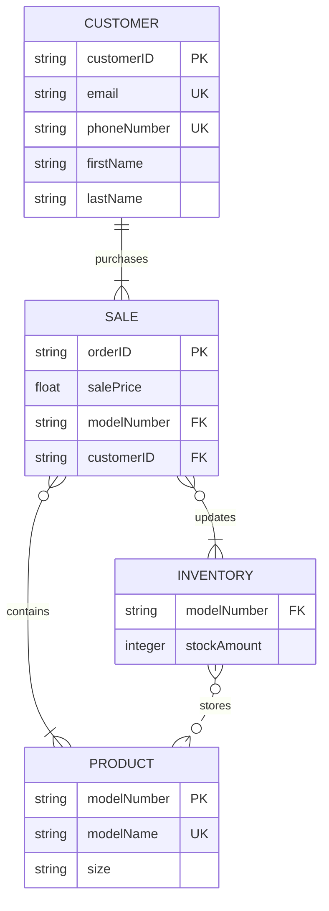

### Products
* Products are Nike shoes.
* Each model number is associated with a particular _size_ of shoe, not just a shoe line.
* Products are held in inventory at different stores and are sold in various sales to customers.
* Products must be linked to sales so that the price for the sale can be determined and so that inventories can be updated to reflect the outflow of product.

### Customers
* Customers are people who purchase products via sales.
* They might share various contact info with the Nike store, such as their name.
* Customer must be linked to sales to charge the correct payment options and to facilitate returns.

### Sales
* Sales are purchases of products by customers.
* Each sale contains the model number of the shoe sold, as well as the sale price.
* Sales must contain products so that the inventories can be properly updated with the accurate count of in-stock products.

### Inventory
* Inventories are records of products that are stored as various locations.
* Products must be linked to inventory so that the store knows what is in stock and available to sell.

